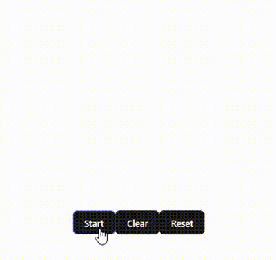

# react-randomizer

> By: [Jaymar921](https://github.com/jaymar921)



A simple Randomizer Component for react projects that can be used for raffle events. With animated scrolling effect 📜. 

# Installation

```
npm i @jaymar921/react-randomizer-component
```

# Demo

[Live Website](https://randomizer-poc.vercel.app/)

# Component
### Randomizer
| Props | Description | default |
| --- | --- | --- |
| backgroundColor | Change the background color of the Randomizer Container that matches your site's background. | `white` |
| textColor | Change the text color of the randomizer (shuffling text). | `black` |
| winnerTextColor | Change the text color of the randomizer (winner text shown). | `black` |
|command | Randomizer Command, `start` command will start the shuffle effect, `clear` command will clear the screen and ready for reshuffle, `reset` command reset's the items list back to original. | undefined |
| items | List\<string\>, data that will be used for shuffling. | undefined |
| duration | The duration of the shuffling effect before a winner is drawn. | `1000` in milliseconds |
| completeCallback | Invoked when a winner is selected, it will pass a parameter of `string`, once a winner is selected, the items list will be modified, removing the selected winner in the array. | `(winner) => { /* your logic goes here */}` |
| fontWeight | Change the weight of the font. | `0` |
| textSize | Size of the Randomizer Text in pixels. | `20` |
| containerWidth | Change the width of the Randomizer Div Container. | `300` |
| containerHeight | Change the height of the Randomizer Div Container. | `100` |
| className | Custom className style for the Randomizer Div Container. | undefined |

# How to use
```js
// app.jsx
import { useState } from 'react'
import './App.css'
import { Randomizer } from '@jaymar921/react-randomizer-component'

function App() {
  const list = ['Jayharron', 'Rodney', 'Kenneth', 'Ada', 'Neal', 'Alyssa', 'Jhon Mark', 'Bo', 'Harold Inacay', 'Harold Cuico', 'Xerxes', 'Raph', 'CJ', 'Dylan'];
  const [command, setCommand] = useState('');

  const onDone = (w) => {
    console.log(w);
  }
  return (
    <>
      <Randomizer 
        backgroundColor='#17A14B' /* Change the Background color of the randomizer */
        textColor='white'         /* Change the Text color of the randomizer (shuffling part) */
        winnerTextColor='red'     /* Change the Text color of the randomizer (winner displayed) */
        command={command}         /* Randomizer command (start, reset, clear) */
        items={list}              /* List of items to be shuffled (array of string) */
        duration={2000}           /* How long will be the shuffling to effect before displaying the winner */
        completeCallback={onDone} /* Invoked when a winner is selected, (winner) => { // your logic }*/
        fontWeight={900}          /* Weight of the font 0 - 900         | default: 0 */ 
        textSize={50}             /* Size of text in pixels             | default: 20 */
        containerWidth={500}      /* Width of the Randomizer container  | default: 300 */
        containerHeight={300}     /* Height of the Randomizer container | default: 100 */
        className=''              /* Custom className style for the Randomizer container */
        />        
      <div>
        <br /> <br />
        <button onClick={() => {setCommand('start')}}>Start</button>
        <button onClick={() => {setCommand('clear')}}>Clear</button>
        <button onClick={() => {setCommand('reset')}}>Reset</button>
      </div>
    </>
  )
}

export default App
```

# Issues / Contribute
Github repo: [react-randomizer](https://github.com/jaymar921/react-randomizer)
